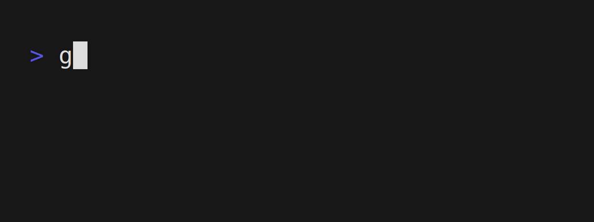

# :recycle: Routines

[](https://pkg.go.dev/github.com/mymmrac/routines)
[](go.mod)
[](https://goreportcard.com/report/github.com/mymmrac/routines)

Simple way to write blocking operations in non-blocking functions/loops without concurrency and with no dependencies.

```shell
go get -u github.com/mymmrac/routines@latest
```

## :jigsaw: Example

Simple hello world with "animated" loader.



```go
package main

import (
	"fmt"
	"time"

	"github.com/mymmrac/routines"
)

func main() {
	r := routines.StartRoutine()
	for !r.Completed() {
		r.Do(func() {
			fmt.Println("Hello Routines!")
			fmt.Print("Loading")
		})
		r.Repeat(3, func() {
			r.WaitFor(time.Second / 2)
			r.Do(func() {
				fmt.Print(".")
			})
		})
		r.Do(func() {
			fmt.Println()
			fmt.Println("Done!")
		})
		r.End()
	}
}
```

## :stars: Features

Routines have two types of controls: actions and waiters.
All controls work only after `Start` and until `End`.

| Action   | Description                         |
|----------|-------------------------------------|
| `Start`  | Start routine execution             |
| `End`    | Finish routine execution            |
| `Do`     | Perform an action                   |
| `Func`   | Call func with other actions inside |
| `Loop`   | Call actions in loop                |
| `Repeat` | Repeat actions N times              |

| Waiter                 | Description                                        |
|------------------------|----------------------------------------------------|
| `WaitFor`              | Wait for time to pass                              |
| `WaitUntil`            | Wait for condition to be true                      |
| `WaitUntilOrTimeout`   | Wait for condition to be true or time to pass      |
| `WaitForDone`          | Wait for chan value to be received                 |
| `WaitForDoneOrTimeout` | Wait for chan value to be received or time to pass |

## :closed_lock_with_key: License

Distributed under [MIT licence](LICENSE).
